# OrcaCNN: Detecting and Classifying Killer Whale from Acoustic Data

Passive acoustic observation of whales is an increasingly important tool for whale research. Accurately detecting whale sounds and correctly classifying them into corresponding whale pods are essential tasks, especially in the case when two or more species of whales vocalize in the same observed area. Most of the current tasks of whale sound detection and classification still need to be implemented manually.

This project aims to develop two deep learning models for the detection and pod-classification of orca, or killer whale calls in unknown long audio samples. These deep neural networks will help identify and verify killer whale calls so that researchers, grad students, and shipping vessels don't have to. The end-user interface is made as a web-app which can easily be used by scientists in their research.

## Pipeline

## Implementation

There are mainly three stages involved in the development of OrcaCNN.

- Data preparation and Pre-processing
- Hyperparameter Tuning and Training with Model Evaluation
- Deployment

Sufficient steps have been mentioned for each of these stages to aid in the development of OrcaCNN model. Each method has its merits and demerits. It is therefore essential to evaluate your choice before proceeding with any method.

The methods chosen for this project have been mentioned besides each method.

##### NOTE: The deployment stage could not be completed due to time constraints. We will gladly accept pull requests for this.

### Data Description

The data was given by [Dan Olsen](https://www.zegrahm.com/field-leaders/dan-olsen) from his research work. The data being around 1 TB was uploaded to a Google Cloud Bucket where the files could directly be accessed. There were several [approaches taken for transferring data to Google Colab](https://github.com/axiom-data-science/OrcaCNN/wiki/Transferring-data#approaches-taken-for-transferring-data-to-google-and-making-it-available-in-colab) and thanks to [Shane](https://github.com/shane-axiom) for writing them down graciously.

The data consisted of two folders:

- Autonomous Recordings NGOS
  - E3
  - E4
  - H2
  - L1
  - L2
  - P2

Most of the autonomous recordings are very quiet, which improves the quality and the distance with which the whale calls can be detected (less distortion). The autonomous recordings need to be amplified, or sensitized, for the spectrograms to capture the whale calls properly. But these are not labelled, and hence cannot be used further except for testing data.

As mentioned by Dan, most of the E3, E4, H2, L1 directories do not have whale calls to aid in automating the process of finding the calls out of a lot of quiet or 'boat noisy' recordings. L1,L2 has the highest percentage of calls, with 50-90% of days that have calls at some point in the day.

The recordings follow the naming convention as `Location followed by deployment number`. For example,
E1 is the first deployment at Etches (Port Etches), P2 is the second deployment at Pony Cove, H1 is the first deployment at Hanning Bay and L2 is second deployment at Little Bay.

File names start with the [hydrophone](https://en.wikipedia.org/wiki/Hydrophone) serial number, followed by date and time of recording. For example: For a file named 67391498.180916010013, the recording was made with hydrophone 67391498 on 2018 September 16th at 1:03 am (and 13 seconds) UTC.

- Field Recordings NGOS

  - 2005 field recordings
  - 2006 field recordings
  to ...
  - 2018 field recordings

The field recordings have a lot of whale calls and as mentioned by Dan, we mainly have three kinds/types of killer whales

- Resident Killer Whales which feeds only on fishes. 
- Transient (or Biggs) Killer Whales which feeds on mammals.
- Offshore Killer Whales which prey mostly on shark. Their calls are very similar to Residents.

For these 14 years of field recordings, around 22 pods exist, namingly, `AD5`, `AD8`, `AD11`, `AD16`, `AK`, `AK1` (or `AK6`), `AK2`, `AB`, `AB25`, `AN10`, `AX48`, `AX32`, `AG`, `AE`, `AI`, `AY`, `AJ`, `AF4`, `AF22`, `AJ14`, `AJ22` and `AS`.

To help address false positive dectection of the presence of killer whale's due to humpback whale vocalization, the [MBARI](https://www.mbari.org/) generously provided a collection of humpback whale calls collected from the [MARS hydrophone](https://www.mbari.org/technology/solving-challenges/persistent-presence/mars-hydrophone/).

### Drawbacks of Classification Model:

The classification model was trained on a total of `22 killer whale pods` as mentioned above. Although we were able to achieve a `66%` accuracy by training a CNN model, there were some drawbacks we faced when  moved to the testing phase.

Majority of the acoustic files were named in the form like: `AS_AD_AG_FieldRecordings..` and for a duration of more than 2 mins or so containing more than 15 calls it was a difficult task to figure which of the pods appeared at which segment of the whole call duration. 

- One of the (unavoidable) mistakes was to not properly have the classes labelled. For instance, for every file named `AS_AD_AG_FieldRecordings..` containing `AS`, `AD` and `AG` calls in it, the whole 1s spectrogram calls were thrown to each of the classes. Unaware of where the whale calls appear in which segment, this was the best thing to do at that point of time. We quickly realized this later.

Luckily, Dan sent over various clips containing individual pod calls, but to my untrained eyes, it was still a challenging task.

Below are some spectrogram images of how those individual pods look like when trained through my `preprocessing` script. Adding a clear description of the difference between the different calls should be much clearly understood by future developers.

<!-- ### AD5 -->

<table>
  <tr>
    <td>AD5</td>
    <td>AD5</td>
  </tr>
  <tr>
    <td>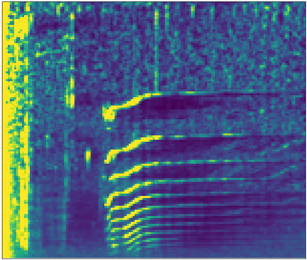</td>
    <td>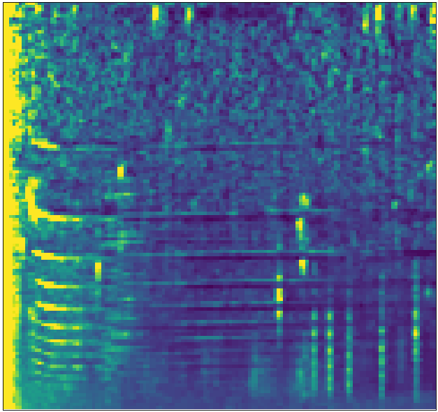</td>
  </tr>
 </table>

 
<!-- 

  
   

 -->

### AD8

### AD11

### AD16

  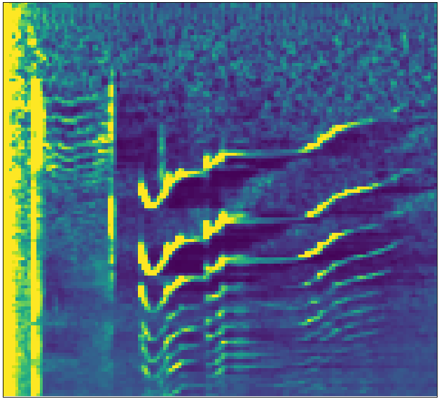
  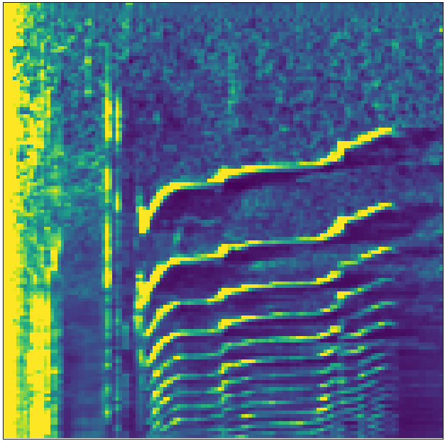 

### AK

  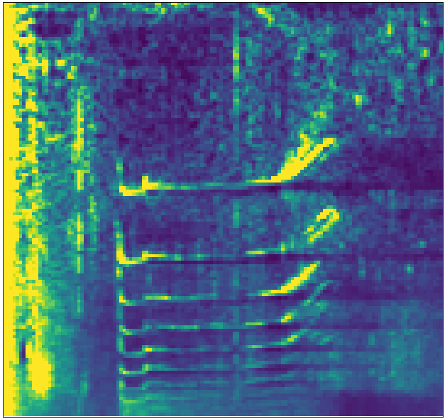
  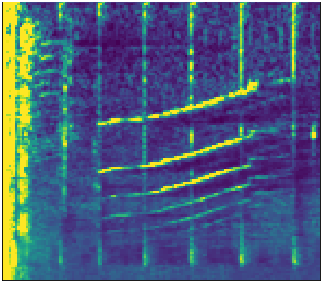 

### AK1 (or AK6)

### AK2

### AB

  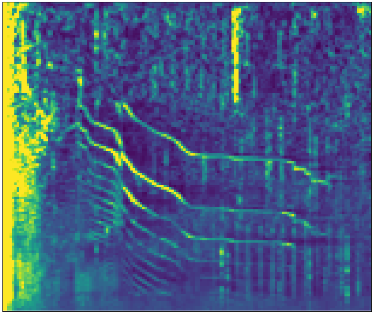
  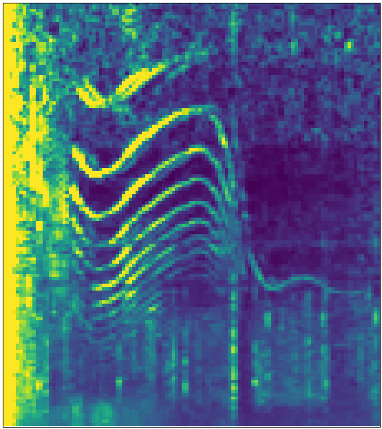 

### AB25

### AN10

  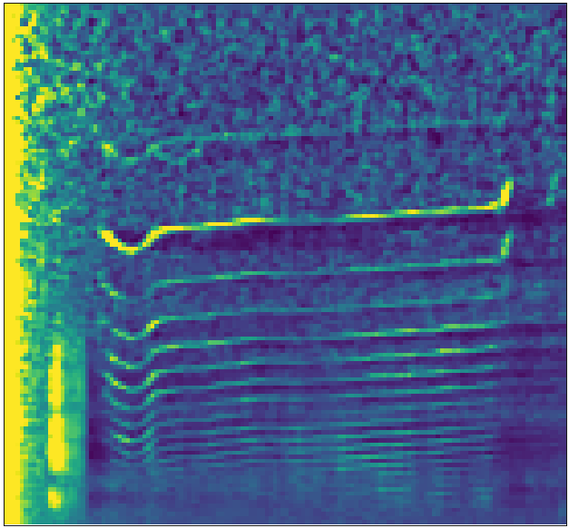
  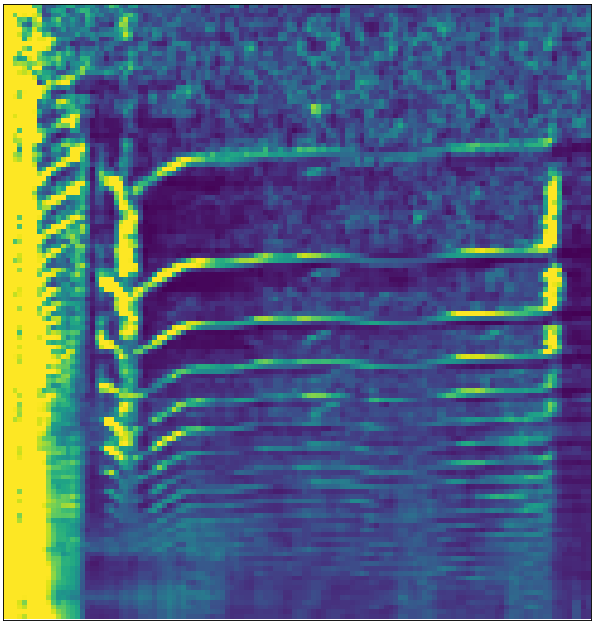 

### AX48/AX32 (pod AX)

  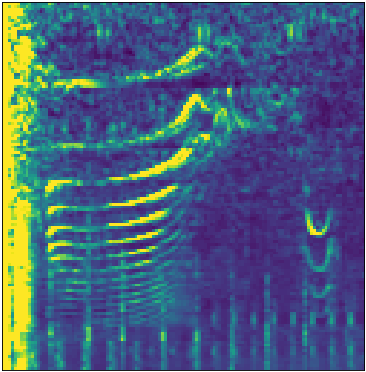
  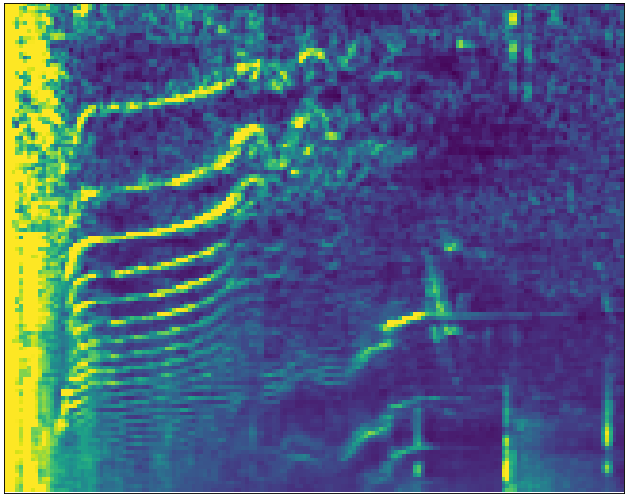 

### AG

  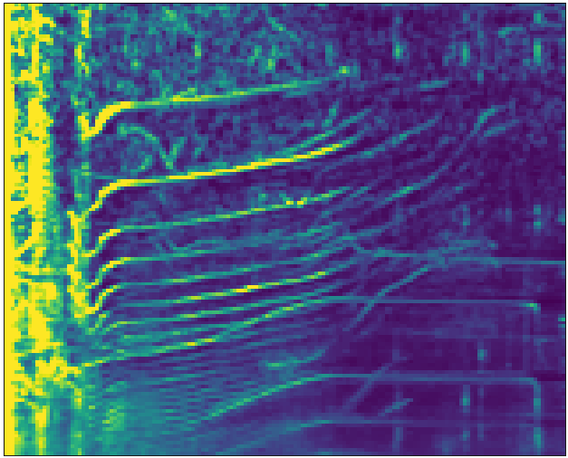
  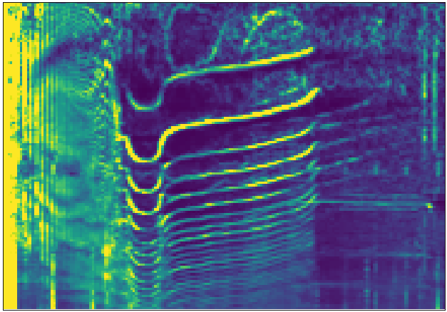 

### AE

  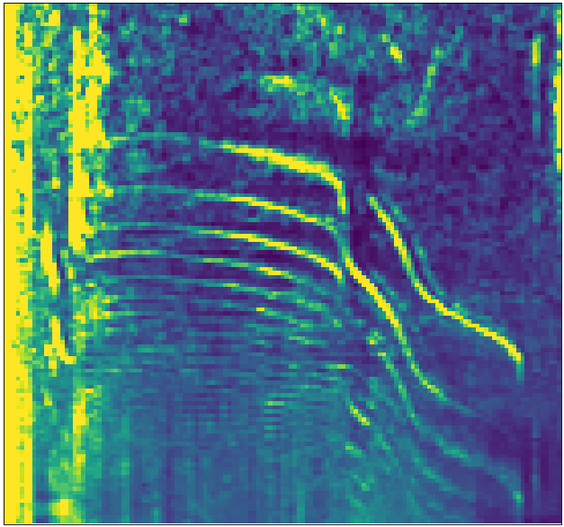
  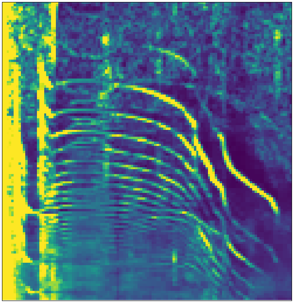 

### AI

  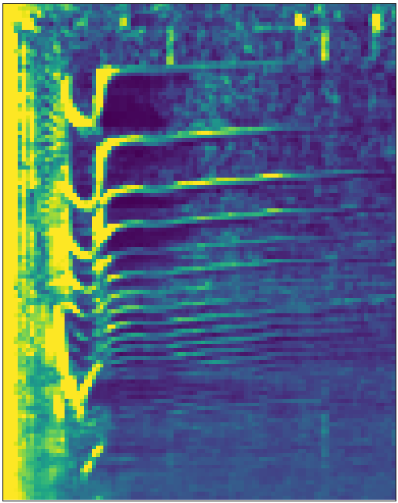
  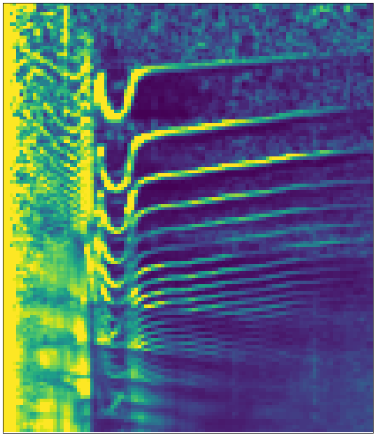 

### AY

### AJ

  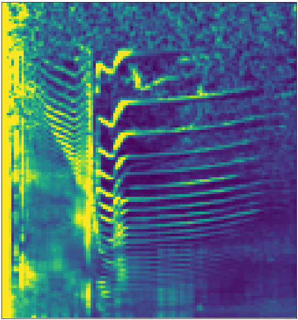
  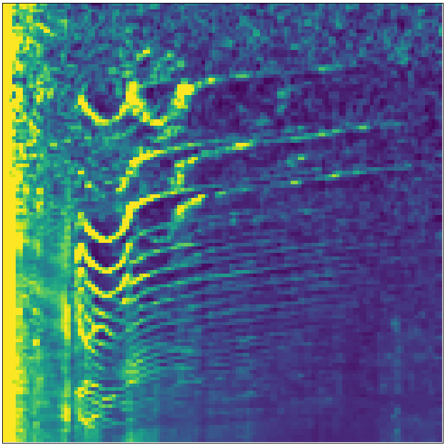 

### AF4

### AF22

  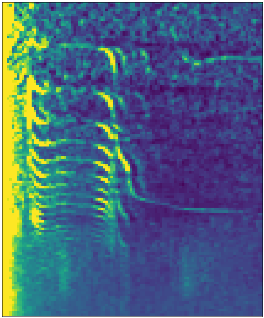
  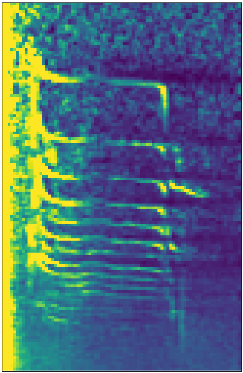 

### AJ14

### AJ22

### AS